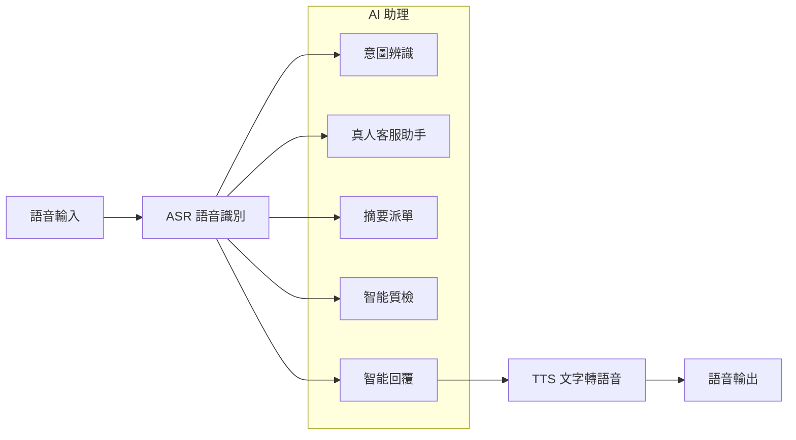

# Voice Support

現代語音客服系統結合人工智慧技術，提供多樣化且靈活的解決方案，提升服務效率與客戶體驗。整體流程從 **語音輸入** 開始，透過 **ASR 語音識別** 將客戶語音轉換為文字，接著依據需求可應用多種 AI 助理功能，靈活地進行進一步處理。

AI 助理涵蓋以下應用：

1. **意圖辨識**：用於解析客戶語音內容，快速了解需求或問題，便於後續處理。
2. **摘要派單**：針對複雜的客戶需求，生成摘要並自動分派至合適的服務部門或系統。
3. **智能質檢**：進行即時的通話監控與分析，確保服務品質符合標準。
4. **智能回覆**：根據意圖辨識結果生成適切的回應內容，並透過 **TTS 文字轉語音** 技術轉化為語音，回覆給客戶。

以上功能的應用可以根據實際需求靈活選用，不一定需要全流程執行，而是針對不同場景與需求進行設計。例如，有些場景可能僅需要意圖辨識，而智能回覆則適用於希望提供即時語音回應的情境。

這些應用模組的結合，構建了一個功能多樣且高度適應性的語音客服生態，實現了更高效且個性化的客戶互動。接下來，將針對各個應用該如何打造 AI 助理與 MaiAgent 的解決方案進行詳細介紹，展示其技術核心與應用價值。

MaiAgent 目前已內建整合多種 ASR 語音識別與 TTS 語音合成，方便使用者根據不同場景來選擇合適的技術。

<figure><figcaption></figcaption></figure>